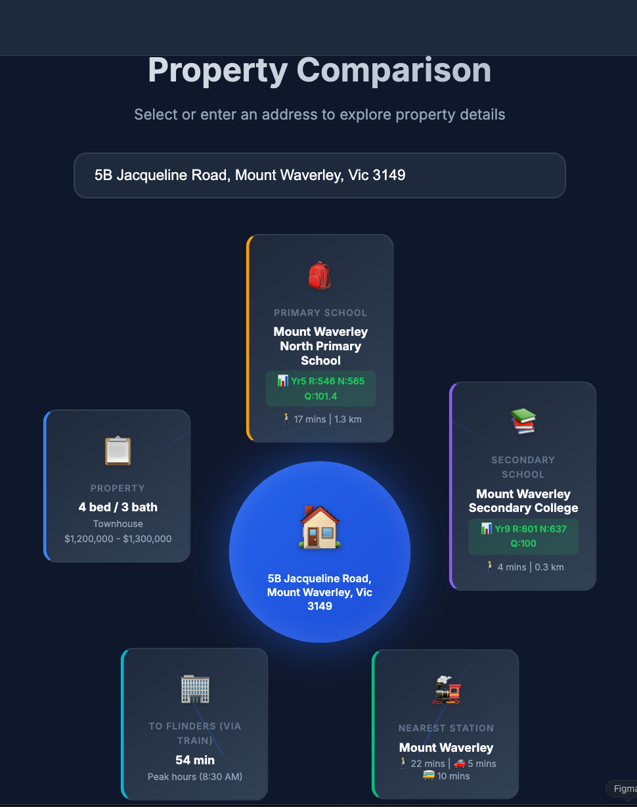
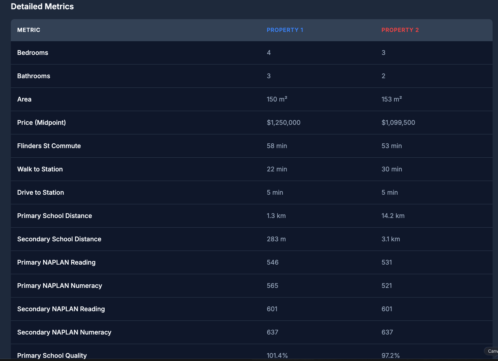

# Mission House

A Melbourne property comparison tool that helps house hunters evaluate properties based on what matters most: school catchments, train stations, NAPLAN scores, and commute times.

**Live Demo:** [koustubh25.github.io/mission-house](https://koustubh25.github.io/mission-house/)






## Features

### Data View

A hub-and-spoke visualization centered on your selected property, showing:

- Property details (beds, baths, price, land area)
- Primary & secondary school catchments with NAPLAN scores
- Nearest train station with walking distance
- Commute time to Flinders Street Station

<!-- TODO: Add screenshot -->

### Compare View

A radar chart comparing up to 4 properties across 13 metrics, including:

- Price, bedrooms, bathrooms, land area
- School distances and NAPLAN scores
- Train station proximity and CBD commute times

<!-- TODO: Add screenshot -->

## Adding Properties

Adding a property requires a few manual steps (the site has anti-bot protection):

1. Run the local server:

   ```bash
   npm install
   node server.js
   ```

2. Open http://localhost:3000 and go to the **Data Entry** tab

3. On [realestate.com.au](https://realestate.com.au), find your property and view page source (right-click → View Page Source)

4. Copy all the HTML (Ctrl+A, Ctrl+C) and paste it into the text area

5. Click **Parse & Add** - the server will automatically fetch school catchments and NAPLAN scores

6. Commit the updated `src/data/houses.json` to save your property

## Tech Stack

- Vanilla JavaScript frontend
- Node.js server for scraping (Puppeteer for NAPLAN scores)
- Google Maps API for commute calculations
- Hosted on GitHub Pages
