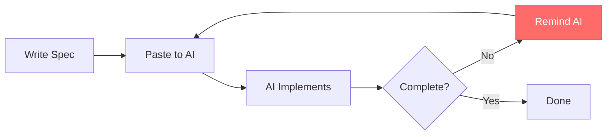
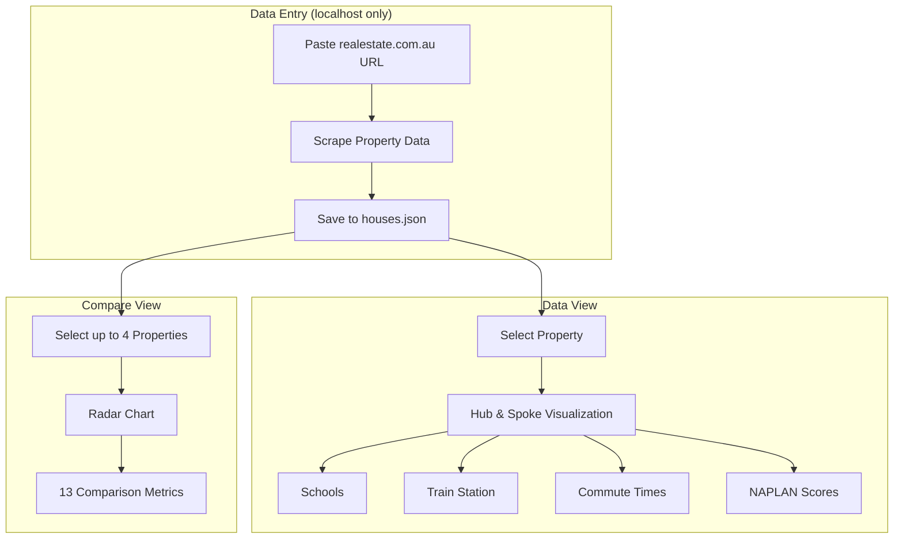
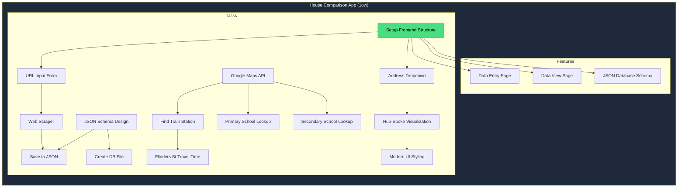

# Building Apps with AI: How `beads` Changed My Development Workflow

*Part 1 of 2: From Spec Documents to Living Issue Trackers*

---

## TL;DR

I built a real estate comparison app using Claude Code and a tool called `beads` - a git-native issue tracker designed for AI-assisted development. This post explores how beads transformed my workflow from writing lengthy spec documents to having a living, breathing project tracker that my AI assistant actually understands.

**Live Demo:** [Mission House App](https://koustubh25.github.io/mission-house/)
**Source Code:** [GitHub Repository](https://github.com/koustubh25/mission-house)

---

## The Problem with Spec-Driven AI Development

If you've worked with AI coding assistants, you've probably experienced this:

1. You write a detailed spec document
2. You paste it into the AI chat
3. The AI implements half of it, forgets the rest
4. You remind it about the forgotten parts
5. It apologizes and starts over
6. Rinse and repeat

The fundamental issue? **AI assistants have limited context windows**, and even the best ones struggle to maintain coherent project state across sessions.



Every time you start a new session, you're essentially starting from scratch - re-explaining context, re-establishing what's done vs. pending, and hoping the AI doesn't hallucinate completed features.

---

## Enter `beads`: Git-Native Issue Tracking for AI

[Beads](https://github.com/steveyegge/beads) is a CLI-based issue tracker that stores everything in `.jsonl` files committed directly to your git repository. Here's what makes it different:

### 1. Issues Live in Your Repo

```bash
.beads/
├── issues.jsonl    # All your issues in one file
├── config.yaml     # Project configuration
└── db.sqlite       # Local cache for fast queries
```

The `issues.jsonl` file is plain text and committed to git. This means:
- **Full history** of every issue change
- **Branching and merging** works naturally
- **AI assistants can read it** to understand project context

### 2. Purpose-Built for AI Workflows

When Claude Code (or any AI assistant with beads integration) starts a session, it can run:

```bash
bd prime  # Loads project context
bd ready  # Shows issues ready to work on
bd list   # Shows all open issues
```

The AI immediately knows:
- What's been completed
- What's currently in progress
- What's blocked and why
- The full dependency graph

### 3. Dependencies That Actually Work

```bash
bd dep add mission-house-abc mission-house-xyz
# "abc depends on xyz" (xyz blocks abc)
```

This creates a clear execution order that both humans and AI can follow.

---

## Quick Start: Installing beads

For macOS users:

```bash
brew tap anthropics/beads
brew install beads

# Initialize in your project
cd your-project
bd init
```

That's it. You now have a `.beads` directory in your repo.

---

## The App: Mission House

Before diving deeper into beads, let me briefly introduce what we built. **Mission House** is a property comparison tool for Melbourne house hunters. It helps answer questions like:

- Which catchment schools serve this address?
- How long is the commute to the CBD?
- How do these 4 properties compare on a radar chart?



The interesting part isn't the app itself - it's **how we built it using beads**.

---

## How I Used beads: A Real Example

### Step 1: Create the Epic

```bash
bd create --title="House Comparison App" --type=epic --priority=1
# Created: mission-house-1ow
```

### Step 2: Break Down into Features

```bash
bd create --title="Data Entry Page" --type=feature --priority=2
bd create --title="Data View Page" --type=feature --priority=1
bd create --title="JSON Database Schema" --type=feature --priority=2
```

### Step 3: Create Tasks with Dependencies

```bash
bd create --title="Set up frontend project structure" --type=task
# Created: mission-house-5mv

bd create --title="Create URL input form" --type=task
bd dep add mission-house-xkj mission-house-5mv
# URL form depends on project structure
```

### Step 4: Let AI Take Over

Here's where the magic happens. When I started my next Claude Code session:

```
> bd ready

mission-house-5mv [P1] [task] open - Set up frontend project structure
  └─ No blockers - ready to work!
```

Claude immediately knew what to work on. No spec re-reading, no context reconstruction - just:

```
> bd update mission-house-5mv --status=in_progress
```

And we're coding.

---

## The Dependency Graph

Here's what our project looked like after the initial planning:



Every arrow represents a `bd dep add` command. The AI knows it can't work on "Web Scraper" until "URL Input Form" is done.

---

## What's Coming in Part 2

In the next post, I'll dive deep into:

1. **The JSONL Advantage** - How storing issues in plain text gives AI assistants "long memory"
2. **Workflow Patterns** - Epics → Features → Tasks hierarchy
3. **Real Issue Examples** - Actual JSON from our project
4. **beads vs. Spec-Driven Development** - A detailed comparison
5. **The Drawbacks** - What didn't work so well
6. **Advanced Features** - Tombstones, sync branches, and multi-session workflows

---

## Key Takeaways

1. **Spec documents are static; beads issues are dynamic** - They evolve with your project
2. **Dependencies prevent AI amnesia** - The assistant always knows what to work on next
3. **Git integration means full history** - Every issue change is tracked
4. **AI-native by design** - Built specifically for Claude Code and similar tools

---

*Continue to [Part 2: Deep Dive into beads Workflow →](./part2-beads-deep-dive.md)*

---

**Tags:** #ai #claude #devtools #productivity #webdev
