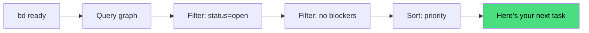
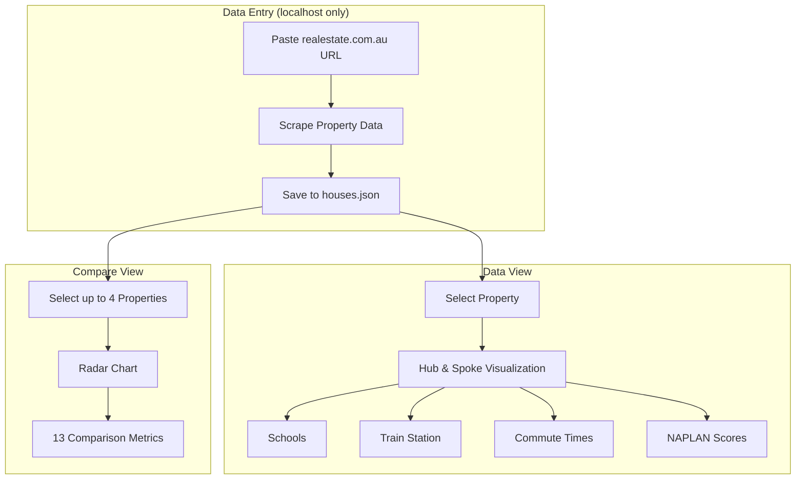
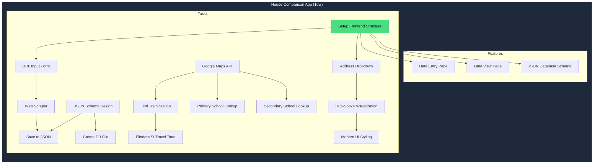

# Building Apps with AI: How `beads` Changed My Development Workflow

*Part 1 of 2: From Spec Documents to Living Issue Trackers*

---

## TL;DR

I built a real estate comparison app using Claude Code and a tool called `beads` - a git-native issue tracker designed for AI-assisted development. This post explores how beads transformed my workflow from writing lengthy spec documents to having a living, breathing project tracker that my AI assistant actually understands.

**Live Demo:** [Mission House App](https://koustubh25.github.io/mission-house/)
**Source Code:** [GitHub Repository](https://github.com/koustubh25/mission-house)

---

## The Spec-Driven Development (SDD) Approach

If you've used AI coding assistants for larger projects, you've likely encountered Spec-Driven Development. Tools like [agent-os](https://buildermethods.com/agent-os/workflow) formalize this into a structured workflow:


SDD uses layered context (Standards → Product → Specs) stored in markdown files like `mission.md`, `roadmap.md`, and `tech-stack.md`. Tasks are *derived from specs*, not created directly.

**SDD works well, but has trade-offs:**

1. **Spec-first philosophy** - You must write specs before creating tasks, even for small changes
2. **Tasks derived from prose** - The AI interprets specs to generate tasks, which requires judgment
3. **No explicit dependency graph** - Dependencies are implicit in the spec narrative
4. **Manual "what's next?"** - Prioritization comes from the spec phase, not computed automatically


SDD is great for complex features that need upfront design. But what if you want to skip straight to task management with automatic prioritization?

---

## Enter `beads`: Task-First with Graph-Based Dependencies

[Beads](https://github.com/steveyegge/beads) is what its creator Steve Yegge calls "a drop-in cognitive upgrade for your coding agents." Instead of the spec-first approach, beads is **task-first** - you create issues directly, with explicit dependencies stored as graph edges.

### 1. Compact JSONL, Not Verbose Markdown

```bash
.beads/
├── issues.jsonl    # All issues in ONE compact file
├── config.yaml     # Project configuration
└── db.sqlite       # Local cache for fast queries
```

One line per issue. No walls of prose. The AI can parse the entire project state in milliseconds:

```json
{"id":"mission-house-ogp","title":"Implement scraper","status":"closed","dependencies":[{"depends_on_id":"mission-house-5mv"}]}
```

### 2. Automatic "What's Next?" via Graph Traversal

This is the killer feature. Instead of the AI parsing prose to figure out priorities:

```bash
bd ready  # Shows only unblocked, high-priority tasks
```

The graph database computes this automatically. No interpretation, no judgment calls - just math.



### 3. Explicit Dependencies = Enforced Execution Order

```bash
bd dep add mission-house-abc mission-house-xyz
# "abc depends on xyz" (xyz blocks abc)
```

This isn't prose that might be ignored - it's a graph edge. The AI literally cannot see `abc` in `bd ready` until `xyz` is closed.

---

## Quick Start: Installing beads

For macOS users:

```bash
brew tap anthropics/beads
brew install beads

# Initialize in your project
cd your-project
bd init
```

That's it. You now have a `.beads` directory in your repo.

---

## The App: Mission House

Before diving deeper into beads, let me briefly introduce what we built. **Mission House** is a property comparison tool for Melbourne house hunters. It helps answer questions like:

- Which catchment schools serve this address?
- How long is the commute to the CBD?
- How do these 4 properties compare on a radar chart?



The interesting part isn't the app itself - it's **how we built it using beads**.

---

## How I Used beads: A Real Example

### Step 1: Create the Epic

```bash
bd create --title="House Comparison App" --type=epic --priority=1
# Created: mission-house-1ow
```

### Step 2: Break Down into Features

```bash
bd create --title="Data Entry Page" --type=feature --priority=2
bd create --title="Data View Page" --type=feature --priority=1
bd create --title="JSON Database Schema" --type=feature --priority=2
```

### Step 3: Create Tasks with Dependencies

```bash
bd create --title="Set up frontend project structure" --type=task
# Created: mission-house-5mv

bd create --title="Create URL input form" --type=task
bd dep add mission-house-xkj mission-house-5mv
# URL form depends on project structure
```

### Step 4: Let AI Take Over

Here's where the magic happens. When I started my next Claude Code session:

```
> bd ready

mission-house-5mv [P1] [task] open - Set up frontend project structure
  └─ No blockers - ready to work!
```

Claude immediately knew what to work on. No spec re-reading, no context reconstruction - just:

```
> bd update mission-house-5mv --status=in_progress
```

And we're coding.

---

## The Dependency Graph

Here's what our project looked like after the initial planning:



Every arrow represents a `bd dep add` command. The AI knows it can't work on "Web Scraper" until "URL Input Form" is done.

---

## What's Coming in Part 2

In the next post, I'll dive deep into:

1. **The JSONL Advantage** - How storing issues in plain text gives AI assistants "long memory"
2. **Workflow Patterns** - Epics → Features → Tasks hierarchy
3. **Real Issue Examples** - Actual JSON from our project
4. **beads vs. Spec-Driven Development** - A detailed comparison
5. **The Drawbacks** - What didn't work so well
6. **Advanced Features** - Tombstones, sync branches, and multi-session workflows

---

## Key Takeaways

1. **Task-first vs. spec-first** - beads lets you create issues directly; SDD requires specs first
2. **Graph-based dependencies** - Explicit edges, not prose to interpret
3. **`bd ready` is the killer feature** - Automatic prioritization via graph traversal
4. **Enforced execution order** - Blocked tasks are invisible until unblocked

---

*Continue to [Part 2: Deep Dive into beads Workflow →](./part2-beads-deep-dive.md)*

---

**Tags:** #ai #claude #devtools #productivity #webdev
