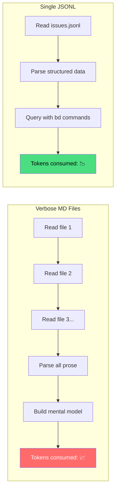
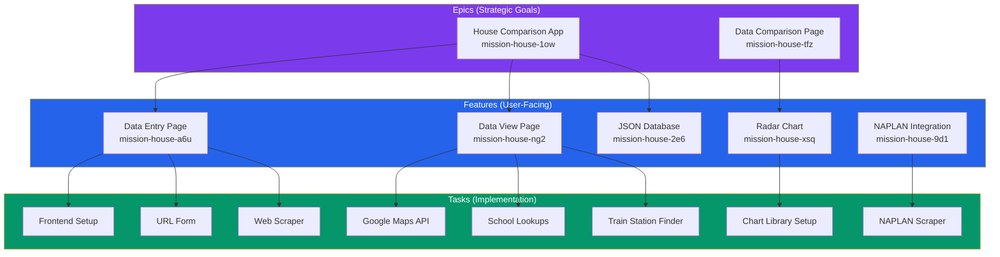
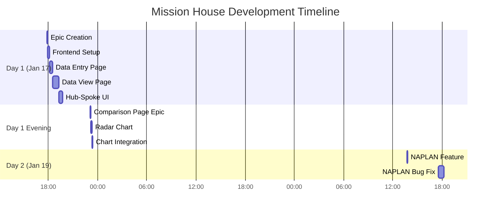

# Building Apps with AI: Deep Dive into beads Workflow

*Part 2 of 2: JSONL Memory, Real Examples, and Honest Drawbacks*

---

## Recap

In [Part 1](./part1-introduction-to-beads.md), I introduced `beads` - a git-native issue tracker designed for AI-assisted development. We looked at the Mission House app and the basic workflow. Now let's go deeper.

---

## The JSONL Advantage: Compact and Queryable

Every beads issue is stored as a single line of JSON in `.beads/issues.jsonl`:

```json
{"id":"mission-house-ogp","title":"Implement myschool.edu.au scraper","description":"Create Puppeteer-based scraper...","status":"closed","priority":1,"close_reason":"NAPLAN scraper implemented in server.js","dependencies":[{"depends_on_id":"mission-house-5mv"}]}
```

Compare this to a typical markdown task file that might span dozens of lines with headers, descriptions, and nested checklists for the same information.

### Why Compact Matters



The AI gets structured data it can query, not prose it must interpret:
- **`bd ready`** - What's unblocked and highest priority?
- **`bd blocked`** - What's waiting on other work?
- **`bd show <id>`** - Full details on one issue
- **`bd stats`** - Project health at a glance

### Close Reasons: Implementation Memory

When you close an issue, you document what was actually built:

```bash
bd close mission-house-ogp --reason="NAPLAN scraper implemented in server.js, handles terms acceptance and score extraction"
```

This becomes searchable context. In future sessions, the AI can see not just "this is done" but *how* it was done.

### Real Example: Session Continuity

Here's what happened when I resumed work on NAPLAN scoring after a break:

**Session 1 (ended with):**
```bash
bd close mission-house-ogp --reason="NAPLAN scores integration complete: scraper implemented in server.js"
```

**Session 2 (started with):**
```bash
> bd ready

mission-house-6t1 [P2] [task] open - Display NAPLAN scores in UI
  └─ Blocked by: mission-house-ogp (closed), mission-house-0ch (closed)
  └─ All blockers resolved - ready to work!
```

Claude immediately knew:
1. The scraper was done (from ogp's close reason)
2. The schema was updated (from 0ch's close reason)
3. The next logical step was UI display

**No context re-establishment needed.**

---

## The Hierarchy: Epics → Features → Tasks

We organized Mission House using a three-level hierarchy:



### Why This Structure Works

| Level | Purpose | Typical Count | Lifetime |
|-------|---------|---------------|----------|
| **Epic** | Strategic goal, multiple sessions | 2-5 per project | Weeks |
| **Feature** | User-facing capability | 5-15 per epic | Days |
| **Task** | Single implementation unit | 3-10 per feature | Hours |

The AI works at the **task level** but understands the **feature and epic context**.

---

## Real Issues from Mission House

Let me show you actual issues from our project to illustrate different patterns:

### Pattern 1: Task with Clear Dependencies

```json
{
  "id": "mission-house-73p",
  "title": "Calculate Flinders Street Station travel time",
  "description": "Calculate travel time to Flinders Street Station during peak hours on a working day from: (a) the nearest train station, (b) the property address directly.",
  "status": "closed",
  "priority": 2,
  "issue_type": "task",
  "close_reason": "Implemented MapsService.getTravelToFlinders() with peak hour scheduling. Calculates transit, driving, walking routes from property and via nearest station",
  "dependencies": [
    {
      "depends_on_id": "mission-house-utk",
      "type": "blocks"
    }
  ]
}
```

**What the AI learned from this:**
- Can't calculate commute until "Find nearest train station" (utk) is done
- Implementation went into `MapsService.getTravelToFlinders()`
- Peak hour scheduling was added
- Multiple route types were implemented

### Pattern 2: Bug with Acceptance Criteria

```json
{
  "id": "mission-house-v4e",
  "title": "Fix naplan score web scraping logic",
  "description": "Naplan score web scraping not working as expected. Check the requirements document",
  "acceptance_criteria": "Naplan score written in json file as in the requirements document",
  "status": "closed",
  "priority": 0,
  "issue_type": "bug",
  "close_reason": "Implemented naplan_quality metric: added benchmark constants, quality calculation function, and UI display in both hub-spoke view and compare page radar chart"
}
```

**Priority 0 (P0)** meant this bug blocked everything else. The AI knew to prioritize this.

### Pattern 3: Tombstone (Deleted Issue)

```json
{
  "id": "mission-house-ck6",
  "title": "Implement spider/radar chart visualization",
  "status": "tombstone",
  "deleted_at": "2026-01-17T23:15:21.909135+11:00",
  "deleted_by": "batch delete",
  "delete_reason": "batch delete",
  "original_type": "task"
}
```

Tombstones preserve history while removing clutter. The AI knows this was deleted and won't try to work on it.

---

## beads vs. Markdown-Based Task Tracking

Let's be honest about the comparison. Tools like `agent-os` and other AI workflow managers also create persistent task lists in files that can be committed to git. So what's actually different?

### The Core Difference: Graph vs. Prose

```mermaid
flowchart TB
    subgraph MD["Markdown Task Tracking"]
        M1["Create task list in MD"]
        M2["AI reads MD file"]
        M3["AI parses prose"]
        M4["AI interprets dependencies"]
        M5["AI makes judgment call"]
        M6["AI picks a task"]

        M1 --> M2 --> M3 --> M4 --> M5 --> M6
    end

    subgraph Beads["beads Graph Database"]
        B1["Create issues with bd"]
        B2["AI runs bd ready"]
        B3["Graph query executes"]
        B4["Unblocked tasks returned"]
        B5["AI picks top priority"]

        B1 --> B2 --> B3 --> B4 --> B5
    end

    style M4 fill:#fbbf24,color:#000
    style M5 fill:#ff6b6b,color:#fff
    style B3 fill:#4ade80,color:#000
    style B4 fill:#4ade80,color:#000
```



### Honest Comparison Table

| Aspect | MD-Based (agent-os, etc.) | beads |
|--------|---------------------------|-------|
| **Persistence** | ✅ Yes (files in git) | ✅ Yes (JSONL in git) |
| **Status tracking** | ✅ Yes | ✅ Yes |
| **Format** | Verbose prose/checklists | Compact JSON (1 line/issue) |
| **Dependencies** | Written in prose | Graph edges (queryable) |
| **"What's next?"** | AI must parse & decide | `bd ready` computes it |
| **Blocked work** | AI must interpret | `bd blocked` shows instantly |
| **Signal-to-noise** | Gets noisy over time | Stays compact |

### The Real Advantage: Automatic Prioritization

Both approaches persist state. The difference is **how the AI determines what to work on next**:

- **MD files:** Parse text → Interpret meaning → Make judgment → Hope it's right
- **beads:** Run `bd ready` → Get mathematically correct answer

When Steve Yegge says beads gives agents "long-horizon task planning capability," this is what he means - the graph handles the planning logic, not the AI's interpretation of prose.

### When MD-Based Still Works

1. **Simple projects** - If you have 5 tasks with no dependencies, a checklist is fine
2. **Human-first workflows** - If humans are the primary readers, prose is more natural
3. **Explanatory context** - Sometimes you need paragraphs to explain *why*, not just *what*

**My approach:** Use beads for execution tracking, keep a lightweight README for high-level context that humans need to understand.

---

## The Drawbacks: What Didn't Work

Let me be honest about the challenges:

### 1. Learning Curve


The CLI commands take time to internalize. `bd dep add A B` means "A depends on B" (B blocks A) - I got this backwards several times.

### 2. Sync Conflicts

When working across multiple branches or machines, sync conflicts can occur:

```bash
> bd list
💡 Tip: Run 'bd sync' to resolve sync conflict
```

The fix is usually simple (`bd sync --from-main`), but it's an extra step that spec documents don't have.

### 3. Over-Granularity Temptation

It's tempting to create a task for everything:

```bash
# Too granular - don't do this
bd create --title="Add import statement for React"
bd create --title="Create empty component file"
bd create --title="Add basic JSX structure"
```

**Better:** One task for "Create React component for X with basic structure"

### 4. Daemon Startup Delays

Occasionally the beads daemon takes time to start:

```bash
> bd list
Warning: Daemon took too long to start (>5s). Running in direct mode.
```

Not a blocker, but noticeable.

### 5. No Visual Dashboard

If you want a Kanban board or burndown chart, you'll need external tools. beads is CLI-first by design.

---

## Advanced Features We Used

### Bulk Operations

When we had duplicate issues, we cleaned up with:

```bash
bd delete mission-house-ck6 mission-house-d1s mission-house-hqs --reason="batch delete"
```

This created tombstones preserving the history.

### Priority System

beads uses P0-P4 priorities:

| Priority | Meaning | Our Usage |
|----------|---------|-----------|
| P0 | Critical | Blocking bugs |
| P1 | High | Core features |
| P2 | Medium | Most tasks |
| P3 | Low | Nice-to-haves |
| P4 | Backlog | Future ideas |

### Close Reasons

Always close with a reason:

```bash
bd close mission-house-qvs --reason="Added Google Maps API with Places and Geometry libraries. MapsService provides geocoding, directions, nearest station search, and autocomplete"
```

This becomes searchable context for future sessions.

---

## Project Timeline Visualization

Here's how our project actually progressed:



**Total active development time:** ~3 hours across 2 days

---

## Key Commands Cheat Sheet

```bash
# Planning
bd create --title="..." --type=epic|feature|task --priority=0-4
bd dep add <issue> <depends-on>

# Working
bd ready                          # What can I work on?
bd update <id> --status=in_progress
bd show <id>                      # Full issue details

# Completing
bd close <id> --reason="..."
bd close <id1> <id2> <id3>        # Bulk close

# Maintenance
bd sync --from-main               # Resolve conflicts
bd doctor                         # Health check
bd stats                          # Project overview
```

---

## Final Thoughts

beads isn't magic - other tools also persist task state across sessions. What makes it different:

1. **Graph-based dependencies** - Not prose to interpret, but edges to query
2. **Automatic prioritization** - `bd ready` computes what's next mathematically
3. **Compact JSONL** - High signal-to-noise ratio as projects grow
4. **Close reasons** - Implementation context preserved for future sessions

The Mission House project went from idea to working app in about 3 hours of active development, spread across multiple sessions. The graph kept track of what was blocked, what was ready, and what was done - with zero manual tracking overhead.

Is beads the only way to do AI-assisted development? No. Is it better than verbose markdown files that become hard to scan? For complex projects with dependencies, absolutely.

---

## Resources

- [beads GitHub Repository](https://github.com/steveyegge/beads)
- [Mission House Demo](https://koustubh25.github.io/mission-house/)
- [Mission House Source](https://github.com/koustubh25/mission-house)
- [Claude Code](https://claude.ai/claude-code)

---

*Thanks for reading! If you try beads on your next AI-assisted project, I'd love to hear how it goes.*

---

**Tags:** #ai #claude #devtools #productivity #projectmanagement #webdev
