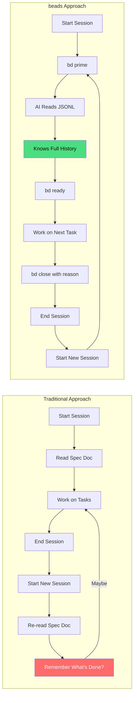

# Building Apps with AI: Deep Dive into beads Workflow

*Part 2 of 2: JSONL Memory, Real Examples, and Honest Drawbacks*

---

## Recap

In [Part 1](./part1-introduction-to-beads.md), I introduced `beads` - a git-native issue tracker designed for AI-assisted development. We looked at the Mission House app and the basic workflow. Now let's go deeper.

---

## The JSONL Advantage: Why Plain Text Matters

Every beads issue is stored as a single line of JSON in `.beads/issues.jsonl`:

```json
{"id":"mission-house-ogp","title":"Implement myschool.edu.au scraper","description":"Create Puppeteer-based scraper for myschool.edu.au to fetch NAPLAN scores. Must handle: 1) Accept terms of use (check checkbox #checkBoxTou, click Accept button), 2) Search for school by name, 3) Extract NAPLAN scores from results page.","status":"closed","priority":1,"issue_type":"task","created_at":"2026-01-19T13:43:24.489562+11:00","closed_at":"2026-01-19T13:49:09.53437+11:00","close_reason":"NAPLAN scores integration complete: scraper implemented in server.js, schema updated with naplan property in schools, UI displays scores in data view and compare pages"}
```

### Why This Matters for AI



The AI doesn't just see "what's open" - it sees:
- **Full descriptions** of every completed task
- **Close reasons** explaining what was implemented
- **Dependencies** showing the logical flow
- **Timestamps** for understanding project velocity

### Real Example: Session Continuity

Here's what happened when I resumed work on NAPLAN scoring after a break:

**Session 1 (ended with):**
```bash
bd close mission-house-ogp --reason="NAPLAN scores integration complete: scraper implemented in server.js"
```

**Session 2 (started with):**
```bash
> bd ready

mission-house-6t1 [P2] [task] open - Display NAPLAN scores in UI
  └─ Blocked by: mission-house-ogp (closed), mission-house-0ch (closed)
  └─ All blockers resolved - ready to work!
```

Claude immediately knew:
1. The scraper was done (from ogp's close reason)
2. The schema was updated (from 0ch's close reason)
3. The next logical step was UI display

**No context re-establishment needed.**

---

## The Hierarchy: Epics → Features → Tasks

We organized Mission House using a three-level hierarchy:


### Why This Structure Works

| Level | Purpose | Typical Count | Lifetime |
|-------|---------|---------------|----------|
| **Epic** | Strategic goal, multiple sessions | 2-5 per project | Weeks |
| **Feature** | User-facing capability | 5-15 per epic | Days |
| **Task** | Single implementation unit | 3-10 per feature | Hours |

The AI works at the **task level** but understands the **feature and epic context**.

---

## Real Issues from Mission House

Let me show you actual issues from our project to illustrate different patterns:

### Pattern 1: Task with Clear Dependencies

```json
{
  "id": "mission-house-73p",
  "title": "Calculate Flinders Street Station travel time",
  "description": "Calculate travel time to Flinders Street Station during peak hours on a working day from: (a) the nearest train station, (b) the property address directly.",
  "status": "closed",
  "priority": 2,
  "issue_type": "task",
  "close_reason": "Implemented MapsService.getTravelToFlinders() with peak hour scheduling. Calculates transit, driving, walking routes from property and via nearest station",
  "dependencies": [
    {
      "depends_on_id": "mission-house-utk",
      "type": "blocks"
    }
  ]
}
```

**What the AI learned from this:**
- Can't calculate commute until "Find nearest train station" (utk) is done
- Implementation went into `MapsService.getTravelToFlinders()`
- Peak hour scheduling was added
- Multiple route types were implemented

### Pattern 2: Bug with Acceptance Criteria

```json
{
  "id": "mission-house-v4e",
  "title": "Fix naplan score web scraping logic",
  "description": "Naplan score web scraping not working as expected. Check the requirements document",
  "acceptance_criteria": "Naplan score written in json file as in the requirements document",
  "status": "closed",
  "priority": 0,
  "issue_type": "bug",
  "close_reason": "Implemented naplan_quality metric: added benchmark constants, quality calculation function, and UI display in both hub-spoke view and compare page radar chart"
}
```

**Priority 0 (P0)** meant this bug blocked everything else. The AI knew to prioritize this.

### Pattern 3: Tombstone (Deleted Issue)

```json
{
  "id": "mission-house-ck6",
  "title": "Implement spider/radar chart visualization",
  "status": "tombstone",
  "deleted_at": "2026-01-17T23:15:21.909135+11:00",
  "deleted_by": "batch delete",
  "delete_reason": "batch delete",
  "original_type": "task"
}
```

Tombstones preserve history while removing clutter. The AI knows this was deleted and won't try to work on it.

---

## beads vs. Spec-Driven Development

Here's an honest comparison:

```mermaid
flowchart TB
    subgraph Spec["Spec-Driven Development"]
        S1["Write detailed spec<br/>(2-4 hours)"]
        S2["AI reads spec"]
        S3["AI implements"]
        S4["Spec becomes outdated"]
        S5["Update spec manually"]

        S1 --> S2 --> S3 --> S4 --> S5 --> S2
    end

    subgraph Beads["beads-Driven Development"]
        B1["Create epic + features<br/>(10 minutes)"]
        B2["AI reads JSONL"]
        B3["AI creates tasks"]
        B4["AI implements task"]
        B5["AI closes with reason"]
        B6["JSONL auto-updated"]

        B1 --> B2 --> B3 --> B4 --> B5 --> B6 --> B2
    end

    style S4 fill:#ff6b6b,color:#fff
    style S5 fill:#ff6b6b,color:#fff
    style B6 fill:#4ade80,color:#000
```



### Comparison Table

| Aspect | Spec-Driven | beads-Driven |
|--------|-------------|--------------|
| **Initial Setup** | Slower (detailed writing) | Faster (bullet points) |
| **Context Loss** | Every session | Never (JSONL persists) |
| **Progress Tracking** | Manual | Automatic |
| **Dependency Handling** | Implicit/forgotten | Explicit/enforced |
| **Multi-session Work** | Painful | Seamless |
| **History** | None/separate doc | Full git history |
| **AI Understanding** | Requires re-reading | Instant via `bd prime` |

### When Spec-Driven Still Wins

1. **Complex domain logic** - Sometimes you need prose to explain *why*
2. **External stakeholders** - Non-technical people prefer docs
3. **Regulatory requirements** - Some industries need formal specs

**My approach:** Use beads for execution, keep a lightweight README for high-level context.

---

## The Drawbacks: What Didn't Work

Let me be honest about the challenges:

### 1. Learning Curve


The CLI commands take time to internalize. `bd dep add A B` means "A depends on B" (B blocks A) - I got this backwards several times.

### 2. Sync Conflicts

When working across multiple branches or machines, sync conflicts can occur:

```bash
> bd list
💡 Tip: Run 'bd sync' to resolve sync conflict
```

The fix is usually simple (`bd sync --from-main`), but it's an extra step that spec documents don't have.

### 3. Over-Granularity Temptation

It's tempting to create a task for everything:

```bash
# Too granular - don't do this
bd create --title="Add import statement for React"
bd create --title="Create empty component file"
bd create --title="Add basic JSX structure"
```

**Better:** One task for "Create React component for X with basic structure"

### 4. Daemon Startup Delays

Occasionally the beads daemon takes time to start:

```bash
> bd list
Warning: Daemon took too long to start (>5s). Running in direct mode.
```

Not a blocker, but noticeable.

### 5. No Visual Dashboard

If you want a Kanban board or burndown chart, you'll need external tools. beads is CLI-first by design.

---

## Advanced Features We Used

### Bulk Operations

When we had duplicate issues, we cleaned up with:

```bash
bd delete mission-house-ck6 mission-house-d1s mission-house-hqs --reason="batch delete"
```

This created tombstones preserving the history.

### Priority System

beads uses P0-P4 priorities:

| Priority | Meaning | Our Usage |
|----------|---------|-----------|
| P0 | Critical | Blocking bugs |
| P1 | High | Core features |
| P2 | Medium | Most tasks |
| P3 | Low | Nice-to-haves |
| P4 | Backlog | Future ideas |

### Close Reasons

Always close with a reason:

```bash
bd close mission-house-qvs --reason="Added Google Maps API with Places and Geometry libraries. MapsService provides geocoding, directions, nearest station search, and autocomplete"
```

This becomes searchable context for future sessions.

---

## Project Timeline Visualization

Here's how our project actually progressed:


**Total active development time:** ~3 hours across 2 days

---

## Key Commands Cheat Sheet

```bash
# Planning
bd create --title="..." --type=epic|feature|task --priority=0-4
bd dep add <issue> <depends-on>

# Working
bd ready                          # What can I work on?
bd update <id> --status=in_progress
bd show <id>                      # Full issue details

# Completing
bd close <id> --reason="..."
bd close <id1> <id2> <id3>        # Bulk close

# Maintenance
bd sync --from-main               # Resolve conflicts
bd doctor                         # Health check
bd stats                          # Project overview
```

---

## Final Thoughts

beads isn't a replacement for thinking through your architecture. It's a tool that:

1. **Preserves context** between AI sessions
2. **Enforces execution order** through dependencies
3. **Creates accountability** through close reasons
4. **Integrates with git** for full history

The Mission House project went from idea to working app in about 3 hours of active development, spread across multiple sessions with zero context loss.

Is beads perfect? No. Is it better than copying specs into chat windows? Absolutely.

---

## Resources

- [beads GitHub Repository](https://github.com/steveyegge/beads)
- [Mission House Demo](https://koustubh25.github.io/mission-house/)
- [Mission House Source](https://github.com/koustubh25/mission-house)
- [Claude Code](https://claude.ai/claude-code)

---

*Thanks for reading! If you try beads on your next AI-assisted project, I'd love to hear how it goes.*

---

**Tags:** #ai #claude #devtools #productivity #projectmanagement #webdev
